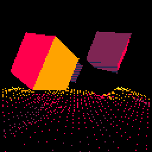

# Everyday One Motion - 20160721  

"Geometry and Cubes"  

  

PICO-8  

[Everyday One Motion](http://motions.work/motion/327)  
[Cartridge](http://www.lexaloffle.com/bbs/?tid=3888)  

## Geometry and Cubes

今回は3Dですね。はい。お察しの通り、PICO-8で3Dするのは苦行ですよ。真似しないほうがいいです。  

## Perspective

2Dの世界において、パースのついた3Dを表現するにはどうすればよいか。  
3Dゲームのエンジンやライブラリなどにおいては、当然のようにこの問題を解いているわけですが、自分で１からこれをやろうとするとけっこう大変です。  
３次元座標系で点の位置を定めて、それを2次元に写す。わあああああ。  

今回は極めて簡単な方法でこれを実現しています。  
まずは軸の向きを決めなければいけませんね。  
今回は、x軸は右が正、y軸は上が正、z軸は手前が正と定義します。いわゆる +y Up, -z Forward ですね。  

さて、表したい点の３次元位置を `(x, y, z)`　、目の位置を `(0.0, 0.0, eyeZ)` 、画面の解像度を `(width, height)` と定めたとき、  
画面上の点の位置 `(screenX, screenY)` は、  
`screenX = x / ( -z + eyeZ ) * width / 2.0 + width / 2.0`  
`screenY = y / ( -z + eyeZ ) * width / 2.0 + height / 2.0`  
とします。  
物体の大きさは物体までの距離に反比例するので、z軸のカメラと点との差をx, yから割ってやればOKです。  
本当はカメラの向きとか視野角とかいろいろ考え始めると計算はめちゃくちゃ複雑になりますが、簡単に実装したい場合はひとまずこれで大丈夫です。  

## Geometry

ちょっとした地形みたいなものを点で書いてみました。  
地形はPerlin Noiseで生成しています。  
Perlin Noiseはいわゆるフラクタルノイズで、ランダムテクスチャを大きさを変えながら複数重ね合わせることによって得られます。  
そんなに難しいアルゴリズムではないですが、こんな感じの地形のようなものが簡単に生成できて便利です。  

## Cubes

キューブは……とても描画が大変でした。  
３次元の物体を描画するには、ポリゴンを描画する必要がありますが、ポリゴンを描画するには、当然三角形を描画する必要があります。  
しかし、まずPICO-8には三角形を描く命令が存在しないので、そこから作ってやる必要がありました。  

三角形は、水平な直線を縦に並べて多数描画することによって実現しています。  
このとき、物体表面の向きに応じて陰影付けをしたいところですが、[覚えていますでしょうか](https://github.com/FMS-Cat/eom_20160707)、PICO-8は16色しか表現することができません！  
そこで今回は、水平な直線ごとに色を変えながら三角形を描画する事によって（y方向のみのディザリング）、陰影を表現しました。
